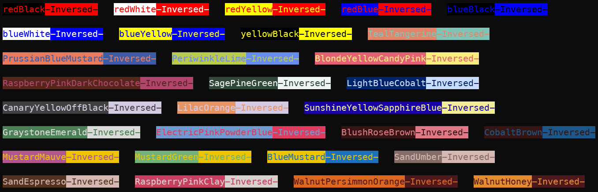

# coloreme [![NPM version][npm-image]][npm-url]

> Suite of color combinations for using in your projects

## Install

```sh
npm install coloreme
```

or

```sh
yarn add coloreme
```

## Usage

```javascript
import { coloreme, coloremeList, colors } from 'coloreme';

console.log(coloreme.LightBlueCobalt);
/*
{
  name: 'LightBlueCobalt',
  color: '#CADCFC',
  bgColor: '#00246B',
  c: '#CADCFC',
  b: '#00246B',
  inverse: { color: '#00246B', bgColor: '#CADCFC', c: '#00246B', b: '#CADCFC' }
}
*/
/* Same as above */
console.log(colors.obj.BluePastelPink);

/* Get some pair by index from list */
console.log(coloremeList[11]);
/*
{
  name: 'BlondeYellowCandyPink',
  color: '#F9EC7E',
  bgColor: '#E26274',
  c: '#F9EC7E',
  b: '#E26274',
  inverse: { color: '#E26274', bgColor: '#F9EC7E', c: '#E26274', b: '#F9EC7E' }
}
*/
/* Previous analogue */
console.log(colors.list[11]);

console.log(colors.random()); // get random color pair
```

## Screenshots



## License

MIT © [Rushan Alyautdinov](https://github.com/akgondber)

[npm-image]: https://img.shields.io/npm/v/coloreme.svg?style=flat
[npm-url]: https://npmjs.org/package/coloreme
